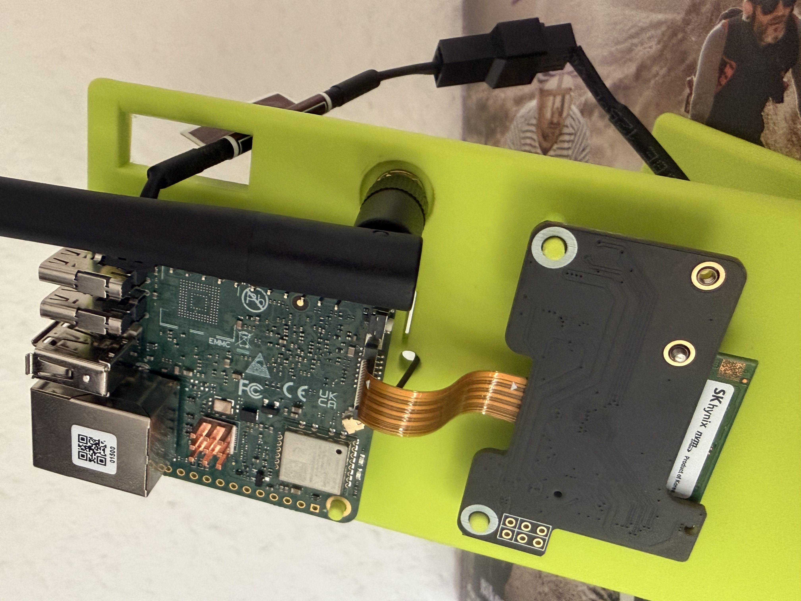
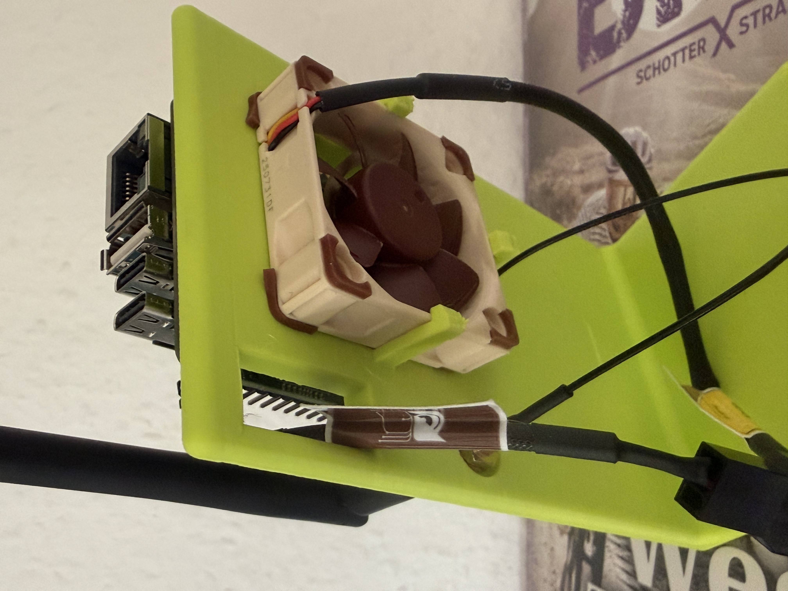

# Dev-Stand with NVMe

Open 3D-printed bench stand for the Radxa Cubie A7S (Allwinner A733). Board and a Waveshare M.2 NVMe adapter lie flat side by side. Rear holder for a 40x10 mm fan, an SMA antenna hole, and a pass-through for the 30-pin GPIO header.

| Assembled board and NVMe | Fan detail |
|--------------------------|------------|
|  |  |

## What it holds

| Part | Notes |
|------|-------|
| Radxa Cubie A7S | Allwinner A733 SBC (eMMC, Gigabit Ethernet, USB, WiFi) |
| M.2 NVMe SSD | Waveshare PCIe-to-M.2 adapter (has driver support). SK hynix module shown |
| PCIe link | Board connector J3, PCIe 3.0 x1 over an FPC ribbon (FPC_2X8P). Only 5 V is on the connector, the NVMe module generates its own rails |
| Fan | 40x10 mm (Noctua NF-A4x10 5V shown) in the rear fan holder |

Measured NVMe throughput on this board: about 562 MB/s sequential read from the SSD.

## Stand features

- Flat base tray. SBC and Waveshare NVMe adapter both lie flat, side by side
- Rear fan holder for a 40x10 mm fan
- SMA antenna hole for a panel-mount antenna connector
- Cable pass-through for the 30-pin GPIO header
- Open frame, all ports, headers, and the board itself stay reachable during bring-up

## Print settings (suggested)

Sensible starting defaults. Tune to your printer and material.

| Setting | Value |
|---------|-------|
| Material | PETG (heat-tolerant near the SBC) |
| Nozzle | 0.4 mm |
| Layer height | 0.2 mm |
| Infill | 20 percent |
| Perimeters | 3 |
| Supports | Only where overhangs need them (fan holder) |

## Files

| File | Description |
|------|-------------|
| Radxa-Cubie-A7s-DevStand-NVMe.3mf | The 3D model (3MF, designed in Autodesk Fusion) |
| images/ | Reference photos of the assembled stand |

## License

Released under [CC BY 4.0](../../LICENSE).
